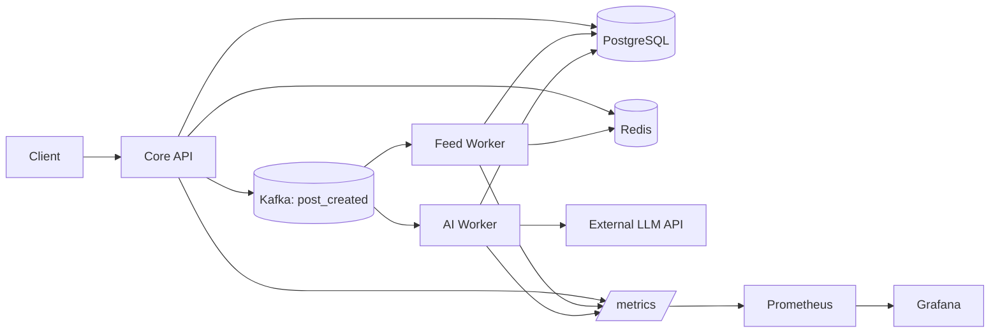
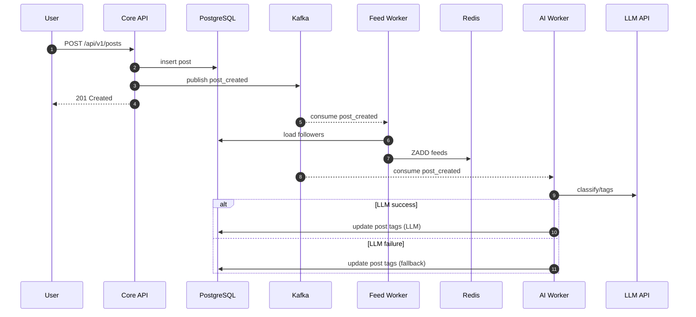

# SmartFeed Platform

SmartFeed is an event-driven backend platform built as a social network core: rapid post creation, fan-out feeds, asynchronous background tasks, and AI-powered auto-tagging.

## TL;DR

- Core API (`cmd/core`): user management, RBAC authentication, posting, feed retrieval.
- Feed Worker (`cmd/feed-worker`): async fan-out-on-write event processing into Redis.
- AI Worker (`cmd/ai-worker`): text moderation and tagging via external LLM completion API (OpenAI / GigaChat) with rule-based fallback.
- Infrastructure: Go, PostgreSQL, Redis, Kafka, Prometheus, Grafana.
- Testing & Quality: `make ci` covers formatting, vet, race detection, unit tests (app logic coverage is >45%), and k6 load testing profiles.

## System Diagram (Mermaid)



## Architecture Outline

```text
Client -> Core API -> PostgreSQL
                 -> Kafka (post_created)
Kafka -> Feed Worker -> Redis (feed:user:<id>)
Kafka -> AI Worker   -> LLM API -> PostgreSQL (tags update)
```

Core decisions:
- Fan-out-on-write: feed reads are extremely fast `O(1)` directly from Redis.
- Async Processing: Heavy operations (feed distribution, LLM calling) are decoupled via Kafka.
- Resilience: API and workers implement graceful shutdown and fallbacks.

## Post Lifecycle (Mermaid Sequence)



## API Documentation (Swagger)

The project includes an auto-generated Swagger UI for exploring and testing endpoints.
Once the Core API is running, access it at:
HTTP GET `http://localhost:8080/swagger/index.html`

Available documented endpoints include:
- `POST /api/v1/auth/register`
- `POST /api/v1/auth/login`
- `GET /api/v1/users/me` (Protected)
- `POST /api/v1/users/follow/{id}` (Protected)
- `POST /api/v1/posts` (Protected)
- `GET /api/v1/feed` (Protected)

## Quick Start

1. Set up the environment configuration:
```bash
cp .env.example .env
```

2. Start the supporting infrastructure using Docker:
```bash
make compose-up
```

3. Run dependency migrations:
```bash
make migrate-up
```

4. Start the application services (in separate terminal windows):
```bash
make run-core
make run-feed-worker
make run-ai-worker
```

5. Verify availability:
```bash
curl http://localhost:8080/health
```

## AI Worker Configuration

The AI worker connects to external LLMs compliant with the OpenAI API format (e.g., GPT models, Sber GigaChat). 

Configure this via your `.env`:
```dotenv
LLM_ENABLED=true
LLM_PROVIDER=openai
LLM_API_KEY=sk-...
LLM_MODEL=gpt-4o-mini
```
If the LLM is unreachable or times out, the worker safely falls back to a deterministic rule-based tagger.

## Load Testing

To run the k6 load testing suite (locally or via docker):
```bash
make load-test
```
Requires Kafka topic initialization (`make kafka-init`), handled automatically in the Makefile target.
Current benchmark profile ensures `< 5%` failure rate and `p(95) < 1500ms` duration under a concurrent mix of registrations, logins, postings, and feed fetches.

## Observability

- Metrics Endpoints: `/metrics` exposes Prometheus measurements.
- Prometheus: `http://localhost:9090`
- Grafana: `http://localhost:3000` (credentials: `admin/admin`)
- Pre-provisioned Dashboards: System Overview and k6 Load Test Analytics.

## Code Quality

To run the local quality gate:
```bash
make ci
```
This runs `go fmt`, `go vet`, `go test`, `go test -race`, and a full build, ensuring stable commits. Fully integrated with GitHub Actions.
